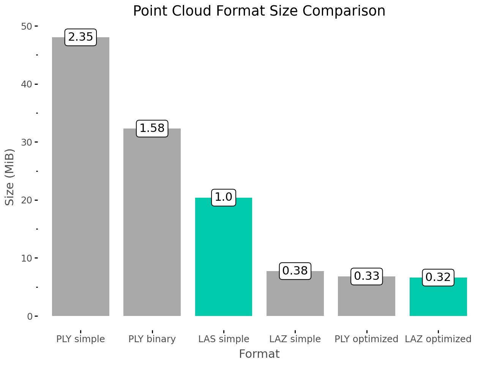

# Point Cloud Format Comparison

A simple analysis of different point cloud file formats looking at 

## Overview

This project evaluates various point cloud file formats commonly used in 3D data processing and analysis:
- **LAS** (Uncompressed)
- **LAZ** (Compressed)
- **PLY** (Multiple variants: simple, binary, optimized)
- **PCD** (Point Cloud Data format)



the data is a single tree scanned using TLS.

## Development Setup

### Prerequisites
- **Pixi** (modern conda package manager alternative) - Install from [pixi.sh](https://pixi.sh)

### Installation

1. Clone or navigate to the project directory:

2. Install dependencies using Pixi:
```bash
pixi install
```

This will create an isolated environment with all required packages as specified in `pixi.toml`.

3. Activate the Pixi environment:
```bash
pixi shell
```


## Author

Simone Massaro <simone.massaro@ugent.be>
